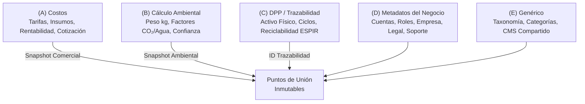

# Cálculo de Reúso — Metodología, Catálogo Maestro de Métricas y Fórmulas

Este documento constituye la referencia técnica, conceptual y matemática oficial sobre la cual opera el motor de cálculo ambiental, costeo comercial y finanzas circulares de **Reúso**.

---

## 1. Metodología de Estimación y Principios Rectores

### 1.1 Prudencia Técnica y Cero Promesas Absolutas
La plataforma opera bajo el principio de **prudencia y transparencia científica**. Queda prohibido el uso de términos absolutos como *"exacto"*, *"garantizado"* o *"100% infalible"*. Toda cifra generada por Reúso se comunica formalmente como una **estimación estructurada y referencial**, respaldada por factores de emisión de ciclo de vida (ACV) y metodologías estandarizadas conforme a las normas **ISO 14040 e ISO 14044**.

### 1.2 Regla de Independencia de Dominios de Datos
Para garantizar la integridad y escalabilidad del sistema, todo dato, cálculo y tabla pertenece estrictamente a uno de los **5 dominios independientes**:



- **Prohibición de Cruces Directos:** Ninguna función, endpoint o consulta SQL mezcla datos de dominios distintos de forma directa sin pasar por un punto de unión inmutable ya establecido (`factor_snapshot_json`, `snapshot_json` o llaves foráneas de trazabilidad).
- **Enfoque en Funcionalidades Reales:** No se crean tablas artificiales para "completar" dominios; cada estructura responde a requerimientos operativos y comerciales concretos.

### 1.3 Criterio de Medición por Masa ($kg$)
Todo factor de impacto ambiental y cálculo de recursos preservados se normaliza **por kilogramo ($kg$) de material o componente**, eliminando distorsiones asociadas a unidades físicas heterogéneas.

### 1.4 Formato Numérico y Reglas de Visualización
- **Alineación:** Valores numéricos siempre alineados a la derecha (`text-right`), fechas y teléfonos centrados.
- **Separadores:**
  - **Pesos Colombianos (COP):** Apóstrofe (`'`) para millones y punto (`.`) para miles (ej. `$ 1'500.000`).
  - **Cantidades, Cédulas y NITs:** Puntos (`.`) exclusivamente (ej. `1.123.456.789`). Prohibido el uso de apóstrofe en documentos de identidad.
- **Redondeo y Decimales:** Coma (`,`) con un único decimal redondeado hacia arriba (`Math.ceil(val * 10) / 10`), omitiendo decimales en enteros exactos (ej. `34 kg`, `3,5 kg CO₂e`).

---

## 2. Hoja de Ruta de Cálculos por Versión (Roadmap de Escalabilidad)

| Versión / Momento | Dominio | Cálculo / Medición | Fórmula Matemática | Propósito / Valor Aportado | Archivo / Pantalla |
|---|---|---|---|---|---|
| **Base (Actual)** | Ambiental | Factor CO₂/kg ($f_{CO_2}$) | $f_{CO_2} = \frac{\text{co2\_unidad}}{\text{peso\_unidad}}$ | Estandariza la huella evitada por kg de material. | `src/lib/calculos/co2.ts` |
| **Base (Actual)** | Ambiental | CO₂ Total Evitado ($CO_{2,\text{total}}$) | $\sum (\text{peso\_kg}_i \times f_{CO_2, i})$ | Cuantifica las emisiones netas evitadas en kg CO₂e. | `src/lib/calculos/co2.ts` |
| **Base (Actual)** | Ambiental | Ahorro Hídrico Total ($Agua_{\text{total}}$) | $\sum (\text{peso\_kg}_i \times f_{\text{agua}, i})$ | Mide los litros de agua preservados por reúso. | `src/lib/calculos/co2.ts` |
| **Base (Actual)** | Ambiental | Equivalencias Narrativas | Árboles, duchas, autos, residuos | Comunica el impacto en unidades cotidianas. | `src/lib/calculos/co2.ts` |
| **Base (Actual)** | Ambiental | Snapshot Inmutable | `factor_snapshot_json` | Blinda los cálculos frente a cambios futuros de tarifas. | `/api/calcular/route.ts` |
| **V1 — Paso 1 y 3** | Costos | Precio Ítem Reacondicionado ($P_{\text{ítem}}$) | $(\sum \text{Servicios} + \sum \text{Insumos}) \times Factor_{\text{rent}}$ | Cotiza servicios y materiales con margen de empresa. | `/empresa/cotizador/nueva` |
| **V1 — Paso 3 y 4** | Costos | Total de Propuesta Comercial | $(\sum P_{\text{ítem}} + \text{Flete} - \text{Desc}) \times (1 + \text{IVA})$ | Genera la cotización final formal para el cliente. | `/empresa/cotizador/[id]` |
| **V1 — Paso 4** | Costos | Snapshot Comercial | `crm_cotizaciones.snapshot_json` | Congela precios e insumos al momento de emitir. | `/api/cotizador/[id]/route.ts` |
| **V2 — Paso 1 y 4** | DPP | Huella Multiciclo Acumulada | $CO_{2,\text{acum}} = CO_{2,\text{base}} \times N_{\text{ciclos}}$ | Mide el beneficio ambiental a lo largo de la vida útil. | `/empresa/dpp/[id]` |
| **V2 — Paso 2** | DPP | Tasa de Reciclabilidad ($R_{\text{fin\_vida}}$) | $\left(\frac{\sum M_{\text{reciclables}}}{M_{\text{total}}}\right) \times 100$ | Cumple con la directriz europea ESPIR de fin de vida. | `/empresa/dpp/nuevo` |
| **V2 — Paso 2** | DPP | Tasa de Inflow Circular | $\left(\frac{M_{\text{secundario}} + M_{\text{renovable}}}{M_{\text{total}}}\right) \times 100$ | Calcula el % de material reciclado o renovable. | `/empresa/dpp/nuevo` |
| **V2 — Paso 5** | Financiero | Retención de Valor ($RRV$) | $\left(\frac{\text{Precio Recuperado}}{\text{Precio Nuevo}}\right) \times 100$ | Demuestra el valor económico retenido del activo. | `/empresa/metas` |
| **V2 — Paso 5** | Financiero | TCO por Ciclo ($TCO_{\text{ciclo}}$) | $\frac{C_{\text{adq}} + C_{\text{op}} + C_{\text{mant}} + C_{\text{disp}} - V_{\text{rev}}}{\max(N_{\text{ciclos}}, 1)}$ | Compara costo de uso por ciclo vs. compra nueva. | `src/lib/calculos/financiero.ts` |
| **V2 — Paso 5** | Financiero | Costo Económico Evitado | $(P_{\text{virgen}} \times Q_{\text{circ}}) + C_{\text{disp}} + C_{\text{imp}}$ | Ahorro monetario directo al evitar insumos vírgenes. | `src/lib/calculos/financiero.ts` |
| **V2 — Paso 5** | Financiero | Retorno de Inversión Circular ($E\text{-}ROI$) | $\left(\frac{\text{Ahorro Operativo} + Costo_{\text{evitado}}}{\text{Inversión Circular}}\right) \times 100$ | Sustenta financieramente la decisión de circularidad. | `/empresa/metas` |
| **V3 — Paso 2** | Costos | Descuentos por Escala y Etapa | $Total \times (1 - Desc_{\text{volumen}})$ | Automatiza descuentos según etapa y volumen. | `/empresa/cotizador` |
| **V3 — Paso 4** | Genérico | Multimoneda Dinámica (23 países) | Formateador regional + separadores | Visualiza propuestas y reportes en moneda local. | `src/lib/locale.ts` |

---

## 3. Catálogo Matemático de Fórmulas

### 3.1 Dominio Ambiental (CO₂ y Recursos Preservados)

#### A. Factor de Emisiones Evitadas ($f_{CO_2}$)
$$\large f_{CO_2} = \frac{\text{co2\_por\_unidad}}{\text{peso\_kg\_unidad}} \quad \left[\frac{\text{kg CO}_2\text{e}}{\text{kg}}\right]$$

#### B. Emisiones Totales Evitadas ($CO_{2,\text{total}}$)
$$\large CO_{2,\text{total}} = \sum_{i=1}^{n} \left(\text{peso\_input\_kg}_i \times f_{CO_2, i}\right) \quad [\text{kg CO}_2\text{e}]$$

#### C. Factor y Total de Ahorro Hídrico ($Agua_{\text{total}}$)
$$\large f_{\text{agua}} = \frac{\text{agua\_por\_unidad}}{\text{peso\_kg\_unidad}} \quad \left[\frac{\text{L}}{\text{kg}}\right], \qquad Agua_{\text{total}} = \sum_{i=1}^{n} \left(\text{peso\_input\_kg}_i \times f_{\text{agua}, i}\right) \quad [\text{Litros}]$$

#### D. Equivalencias Narrativas de Impacto
1. **Árboles diarios equivalentes:** $\text{Árboles} = \left\lfloor \frac{CO_{2,\text{total}}}{25{,}0 / 365} \right\rceil$
2. **Duchas de 5 minutos ahorradas:** $\text{Duchas} = \left\lfloor \frac{Agua_{\text{total}}}{100{,}0} \right\rceil$
3. **Emisiones anuales de vehículos evitadas:** $\text{Autos/año} = \frac{CO_{2,\text{total}}}{4600}$
4. **Residuos Desviados de Relleno Sanitario ($M_{\text{desviada}}$):** $M_{\text{desviada}} = \sum_{i=1}^{n} \text{peso\_input\_kg}_i \quad [\text{kg}]$

---

### 3.2 Dominio Financiero & Finanzas Circulares

#### A. Costo Total de Propiedad por Ciclo ($TCO_{\text{ciclo}}$)
$$\large TCO_{\text{ciclo}} = \frac{C_{\text{adquisición}} + C_{\text{operación}} + C_{\text{mantenimiento}} + C_{\text{disposición}} - V_{\text{reventa}}}{\max(N_{\text{ciclos}}, 1)}$$

#### B. Costo Económico Evitado ($Costo_{\text{evitado}}$)
$$\large Costo_{\text{evitado}} = (P_{\text{virgen}} \times Q_{\text{circular}}) + C_{\text{disposición\_evitado}} + C_{\text{impuesto\_evitado}}$$

#### C. Retorno de Inversión en Economía Circular (E-ROI)
$$\large E\text{-}ROI (\%) = \left(\frac{\text{Ahorro Operativo} + Costo_{\text{evitado}}}{\text{Inversión en Circularidad}}\right) \times 100$$

#### D. Ratio de Retención de Valor Económico ($RRV$)
$$\large RRV (\%) = \left(\frac{\text{Precio Mercado Producto Recuperado}}{\text{Precio Mercado Producto Nuevo Equivalente}}\right) \times 100$$

#### E. Tasa de Inflow Circular (% Materiales Secundarios/Renovables)
$$\large Inflow_{\text{circular}} (\%) = \left(\frac{M_{\text{secundario\_kg}} + M_{\text{renovable\_kg}}}{M_{\text{total\_input\_kg}}}\right) \times 100$$

---

### 3.3 Dominio de Cotización & Servicios (Costos Comerciales)

#### A. Precio Unitario del Ítem Reacondicionado ($P_{\text{ítem}}$)
$$\large P_{\text{ítem}} = \left(\sum \text{Servicios} + \sum (\text{Cantidad}_{\text{insumo}} \times \text{Precio Unitario}_{\text{insumo}})\right) \times Factor_{\text{rentabilidad}}$$

#### B. Total de la Propuesta Comercial ($Total_{\text{propuesta}}$)
$$\large Total_{\text{propuesta}} = \left(\sum (P_{\text{ítem}} \times \text{Cantidad}) + \text{Transporte} - \text{Descuento}\right) \times (1 + \text{IVA})$$

---

### 3.4 Dominio de Pasaporte Digital de Producto (DPP / ESPIR)

#### A. Tasa de Reciclabilidad al Fin de Vida ($R_{\text{fin\_vida}}$)
$$\large R_{\text{fin\_vida}} (\%) = \left(\frac{\sum M_{\text{reciclables\_kg}}}{M_{\text{total\_activo\_kg}}}\right) \times 100$$

#### B. Impacto Ambiental Acumulado en el Ciclo de Vida ($CO_{2,\text{acumulado\_dpp}}$)
$$\large CO_{2,\text{acumulado\_dpp}} = CO_{2,\text{evitado\_base}} \times N_{\text{ciclos\_registrados}}$$

---

## 4. Inmutabilidad y Snapshotting Criptográfico

Al registrar un cálculo o emitir una propuesta comercial, el sistema genera dos snapshots inmutables:

1. **`factor_snapshot_json` (Dominio Ambiental):**
```json
{
  "items": {
    "<item_id>": {
      "co2_por_unidad": 3.5,
      "peso_kg_unidad": 0.5,
      "co2_por_kg": 7.0,
      "agua_por_kg": 150.0,
      "nivel_confianza": "alta",
      "origen_fuente": "ecoinvent v3.9"
    }
  },
  "version_factores": "2026-08-20",
  "metodologia": "ACV simplificado conforme a ISO 14040/14044 y directrices ESPIR"
}
```

2. **`snapshot_json` (Dominio Costos Comercial):**
Congela precios unitarios, subtotales de servicios, costo de insumos, margen de rentabilidad, flete e IVA vigentes al momento de la firma o envío.

---

## 5. Referencias de Código Activo
- `src/lib/calculos/co2.ts` — Lógica pura de cálculo ambiental y equivalencias narrativas.
- `src/lib/calculos/financiero.ts` — Fórmulas de TCO, E-ROI, Costo Evitado y Tasa de Inflow Circular.
- `src/app/api/cotizador/` — Motor de cotización, diagnóstico y emisión de propuestas.
- `src/app/api/calcular/route.ts` — Ingesta de cálculo y snapshotting inmutable.
